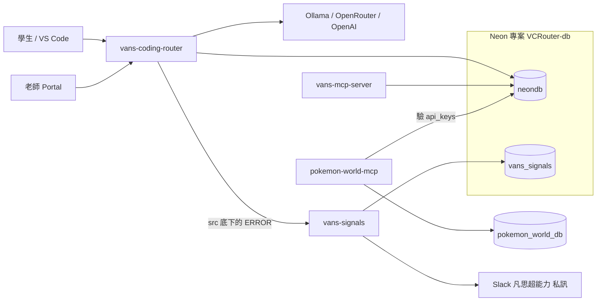
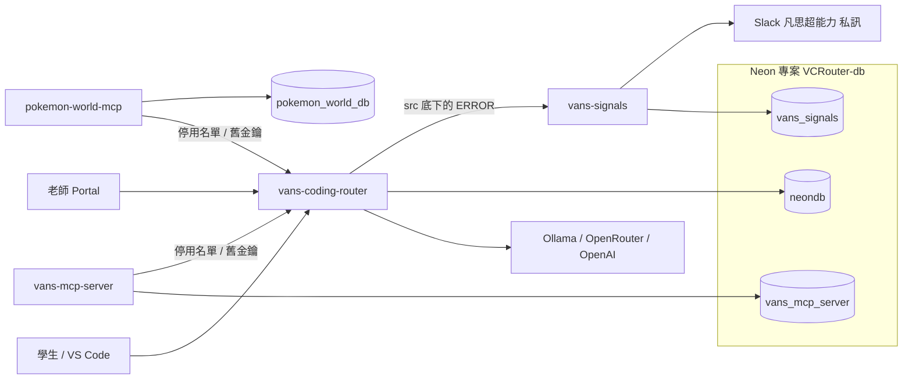

# 正式環境系統圖

發到 Slack 私訊的是 `vans-signals`。本機和 staging 的 router 沒有設定目的地，所以不在這兩張圖上。遊戲存檔在另一個 Neon 專案 `pokemon_world_db`，沒有接到 router 這條路。

2026-10-08 從 Neon 後台確認：`VCRouter-db` 只有一個 `production` 分支，裡面是 `neondb` 和 `vans_signals`。整個分支只有一組 role `neondb_owner`，兩個 database 都是它擁有。router、`vans-mcp-server`、`pokemon-world-mcp`（連 router 那邊）和 `vans-signals` 現在都用這組連線。

## 現在

`vans-mcp-server` 和 `pokemon-world-mcp` 都連 `neondb` 驗 `api_keys`。`vans-mcp-server` 也把工具呼叫紀錄和 Google／Discord 授權寫在 `neondb`。

## 規格 4 完成後

兩個 MCP 都不連 `neondb`。簽章票在各自的服務驗，並對 router 公布的停用名單；舊格式金鑰送到 router 的 `POST /internal/legacy-key`。`vans-mcp-server` 的工具呼叫紀錄和學生授權改放在同一個專案裡的 database `vans_mcp_server`。它的 role 只能連 `vans_mcp_server`。`vans-signals` 改用只能連 `vans_signals` 的 role。pokemon 的遊戲庫仍是專案 `pokemon_world_db`。

順序是：先上停用名單、舊金鑰檢查和簽章驗證，這時授權仍在 `neondb`。MCP 驗得了簽章票之後才開始發。接著複製、短暫停寫、補差額，把 `vans-mcp-server` 的 `DATABASE_URL` 切到 `vans_mcp_server`。確認新庫已接手、既有授權還能用之後，從 `neondb` 刪掉 `mcp_usage` 和 `mcp_oauth_connections`。

role 的名稱、router 要不要改成只能連 `neondb` 的專屬 role、pokemon 在還連 `neondb` 的過渡期用哪個帳號、以及 `vans-signals` 換帳號排在哪一步，還沒定。

