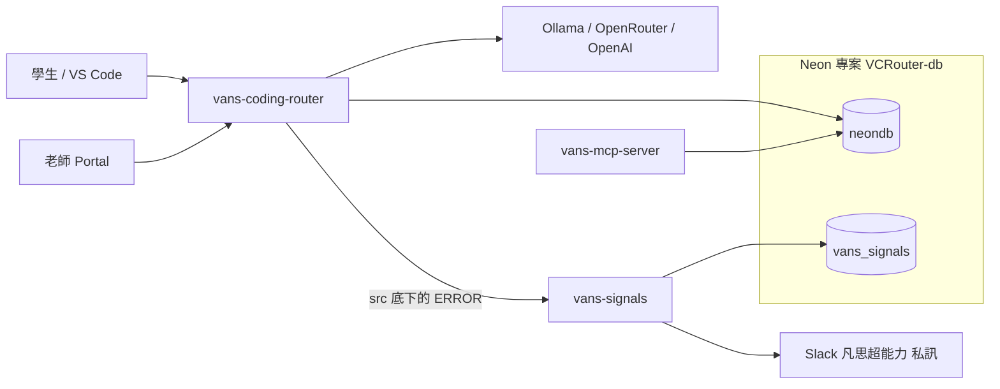

# 正式環境系統圖

`vans-mcp-server` 只和 `vans-coding-router` 共用 `neondb`。發到 Slack 私訊的是 `vans-signals`。本機和 staging 的 router 沒有設定目的地，所以不在這張圖上。`pokemon_word_db` 是另一個 Neon 專案，沒有接到這條路。

```mermaid
flowchart LR
  student[學生 / VS Code] --> router[vans-coding-router]
  teacher[老師 Portal] --> router
  router --> upstream[Ollama / OpenRouter / OpenAI]
  router --> neondb[(neondb)]
  mcp[vans-mcp-server] --> neondb

  router -->|src 底下的 ERROR| signals[vans-signals]
  signals --> sigdb[(vans_signals)]
  signals --> slack[Slack 凡思超能力 私訊]

  subgraph neon [Neon 專案 VCRouter-db]
    neondb
    sigdb
  end
```
