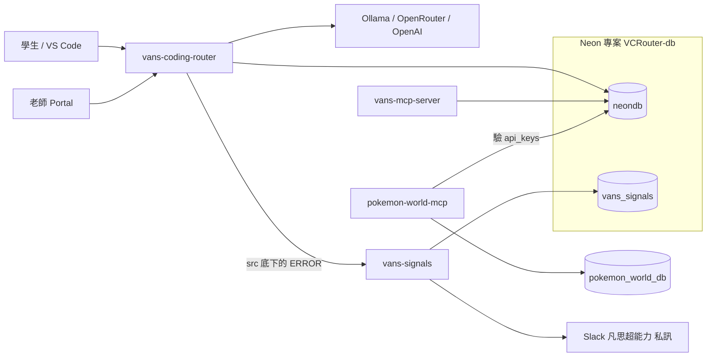
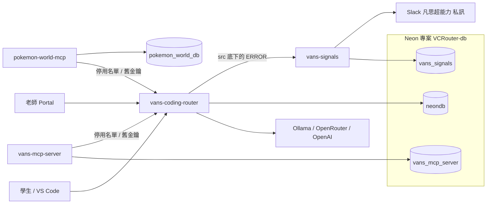

# 正式環境系統圖

發到 Slack 私訊的是 `vans-signals`。本機和 staging 的 router 沒有設定目的地，所以不在這兩張圖上。遊戲存檔在另一個 Neon 專案 `pokemon_world_db`，沒有接到 router 這條路。

2026-10-08 從 Neon 後台確認：`VCRouter-db` 只有一個 `production` 分支，裡面是 `neondb` 和 `vans_signals`。整個分支只有一組 role `neondb_owner`，兩個 database 都是它擁有。router、`vans-mcp-server`、`pokemon-world-mcp`（連 router 那邊）和 `vans-signals` 現在都用這組連線。

## 現在

`vans-mcp-server` 和 `pokemon-world-mcp` 都連 `neondb` 驗 `api_keys`。`vans-mcp-server` 也把工具呼叫紀錄和 Google／Discord 授權寫在 `neondb`。

## 規格 4 完成後

兩個 MCP 都不連 `neondb`。簽章票在各自的服務驗，並對 router 公布的停用名單；舊格式金鑰送到 router 的 `POST /internal/legacy-key`。`vans-mcp-server` 的工具呼叫紀錄和學生授權改放在 database `vans_mcp_server`，role 是 `vans_mcp_server_app`。`vans-signals` 的 role 是 `vans_signals_app`。router 的 role 是 `vans_coding_router_app`，只能連 `neondb`。`neondb_owner` 只留作管理帳號，不放進執行中的服務。pokemon 的遊戲庫仍是專案 `pokemon_world_db`，那組帳號不動。

順序是：先把 `vans-signals` 換成 `vans_signals_app`，並確認它連 `neondb` 被拒。這一步不撤銷 `neondb_owner` 對 `neondb` 的連線。接著上停用名單、舊金鑰檢查和簽章驗證，授權仍在 `neondb`。pokemon 在這之前仍用它 Fly secret 裡的 `neondb_owner`；驗票切換時拿掉這條連線，不另建暫時 role。MCP 驗得了簽章票之後才開始發。然後複製、短暫停寫、補差額，把 `vans-mcp-server` 切到 `vans_mcp_server_app`。確認新庫已接手、既有授權還能用之後，從 `neondb` 刪掉 `mcp_usage` 和 `mcp_oauth_connections`。router 改用 `vans_coding_router_app` 的那一步還沒定。

