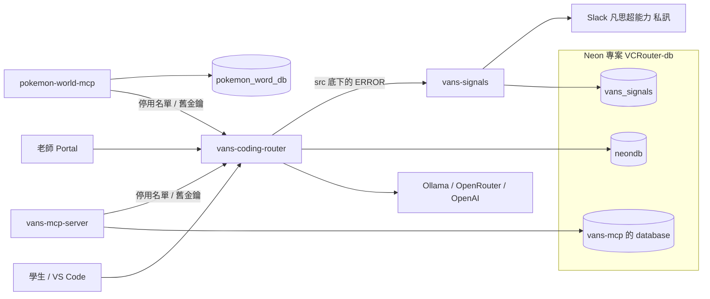

# 正式環境系統圖

發到 Slack 私訊的是 `vans-signals`。本機和 staging 的 router 沒有設定目的地，所以不在這兩張圖上。`pokemon_word_db` 是另一個 Neon 專案，遊戲存檔在那裡，沒有接到 router 這條路。

## 現在

`vans-mcp-server` 和 `pokemon-world-mcp` 都連 `neondb` 驗 `api_keys`。`vans-mcp-server` 也把工具呼叫紀錄和 Google／Discord 授權寫在 `neondb`。

## 規格 4 完成後

兩個 MCP 都不連 `neondb`。簽章票在各自的服務驗，並對 router 公布的停用名單；舊格式金鑰送到 router 的 `POST /internal/legacy-key`。`vans-mcp-server` 的工具呼叫紀錄和學生授權改放在 `VCRouter-db` 裡的另一個 database，和 `neondb`、`vans_signals` 並列，而且不能讀 `neondb` 的表。pokemon 的遊戲庫仍是 `pokemon_word_db`。

